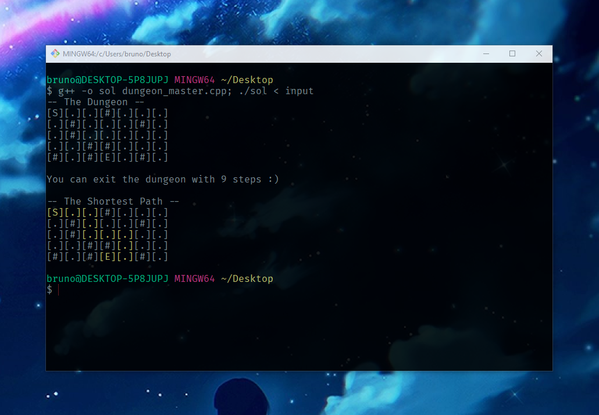

# The dungeon master 2d

#### Task

Given 2d dungeon grid find the shortest path from the starting point ('S') to the exit point ('E').

You can move in north, east, south and west direction IFF the ceil is free ('.') and not blocked with a stone ('#').

If it's possible to exit the dungeon print the amount of steps that it takes, else print it's not possible.

#### Notes

I'm additionally printing some nice visualization, because why not :)

